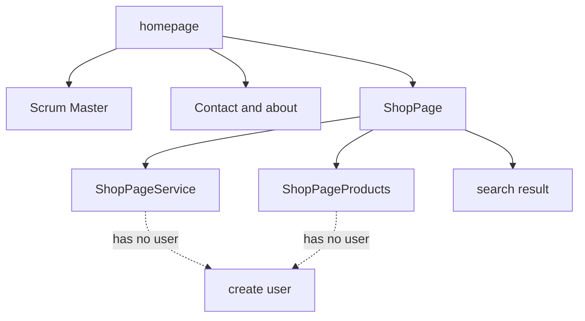

# project Vinylducky.NL
[img]

[Jira bord](https://vinylducky.atlassian.net/jira/software/projects/ECBGI/boards/3)


## Deploy

```bash
nuxt generate 
firebase deploy
```

## Tech stack

Nuxt 3 (3.11)
Vue 3
Bootstrap 5
SCSS (SASS 1.7)
MermaidJS
NPM

## Page Structure



## Structure
// ------------- Init and Import
// ------------- Data
// ------------- Hooks / methods
// ------------- Logic
// ------------- SEO

## position
1 0 [  7 / 001 ]