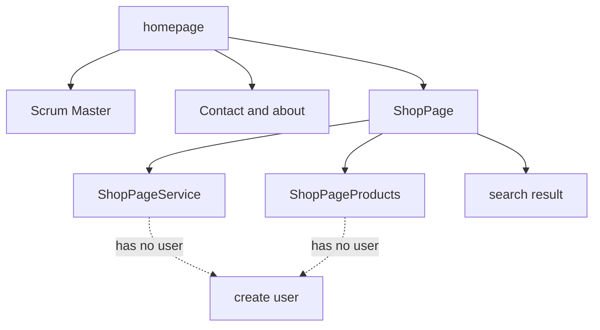

<p align="center">
  
</p>

# VinylDucky.nl

Version: __0.0.1__
Sprint: 1

At our core we are thinkerers, and this is one of our projects. We love making demos and letting people have a look. If you found anything interesting just leave a message.

[Jira bord](https://vinylducky.atlassian.net/jira/software/projects/ECBGI/boards/3)


## Deploy
Static build for firebase.
```bash
npm run generate 
firebase deploy
```

## Tech stack

| Tech              | Version   | Note  |
|---                |---        |---    |
| Nuxt              | 3.11      |       |
| Vue               | 3         |       |
| Bootstrap         | 5         |       |
| Bootstrap Icons   | 1.11      |       |
| SCSS              | (SASS 1.7) |      |
| MermaidJS         |           |       |
| NPM               |           |       |
| Firebase Hosting  | 9         |       | 
| Pinia             | 2.1.7     |       |

## Page Structure



## Structure
<!-- 0.1.0 -->
// ------------- Init and Import
// ------------- Hooks 
// ------------- Props
// ------------- Data
// ------------- Logic
// ------------- SEO

