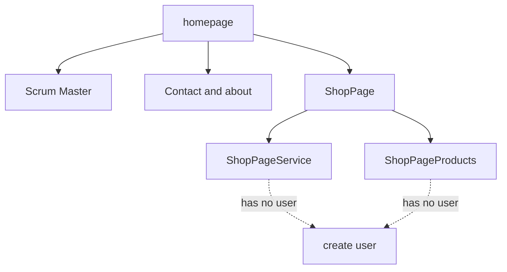

# project Vinylducky.NL
[img]

[Jira bord](https://vinylducky.atlassian.net/jira/software/projects/ECBGI/boards/3)

## Tech stack

Nuxt 3
Vue 3
Bootstrap 5
SCSS (SASS 1.7)
MermaidJS
NPM

## Page Structure

## position
1 0 [  2 / 003 ]